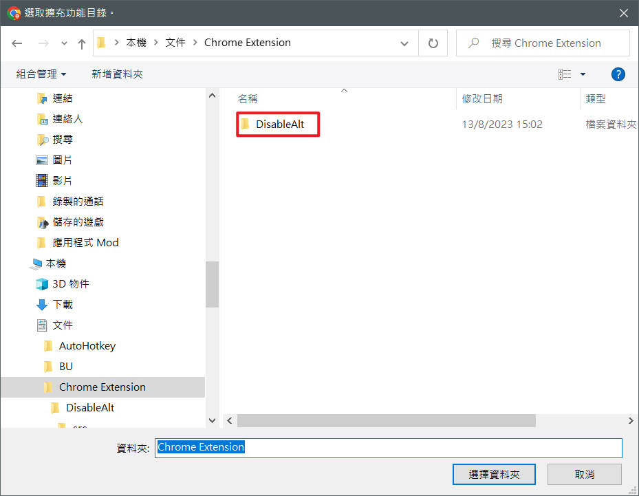

🌏 English | **[繁體中文](README_CNT.md)**

# Disable `ALT` focus In Chrome

Disable the annoying menu focus, when user press the `ALT` key

---
_**What this extension do**_: 
> - Force to disable focus on menu when user press `ALT`
> - Will not effect the `ALT` action, like hotkeys `ALT+C`, `ALT+1`, ... \
    `Other Alt+[key] still work, u can use other extension without any problem`

    

How to install

### Installation Guide
1. Download the ZIP file from this repository and unzip it

2. Open Chrome options Menu > Extension > Manage Extension

3. Turn On Developer Mode, then choose Load Unpacked

4. Choose and Select the unzipped folder
> **Please make sure the ZIP file already UNZIPPED**

6. The extension will active when installed

TODO:
---
- [ ] Add On/Off Option
